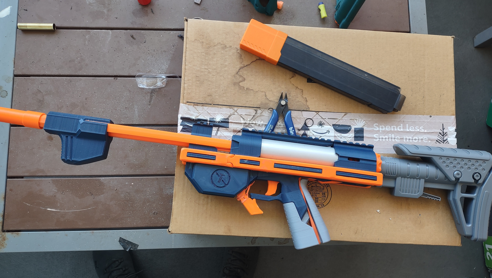

# LowHardwareTCU
The Low Hardware TCU, a blaster with barely any non-printed parts.

- Changelog: 5-2-22: I apparently posted the wrong Plunger and SpringCap files. Please use the updated current files.

## Description

Blaster overview: https://www.youtube.com/watch?v=glRXdd7pP-U

Printed plunger tube overview: https://www.youtube.com/watch?v=QpMW5P51Vow

Full assembly video here: WIP

This is the Low Hardware TCU, a blaster with barely any non-printed parts. It uses no screws, no metal pins, barely anything that isn't printed. The only non-printed parts are

- 3 rubber bands (1 for the mag releases, 2 for the trigger/sear)
- TC length 788 main spring
- 1x 012 o-ring
- 2x -123 o-rings

## "Really? You can print THAT?!"

The plunger tube is a fully printed design that fits in standard TCs without modification to the blaster. Use more lubrication in the plunger tube than you normally would. Printed plunger tubes for other popular homemades can be found here: https://github.com/Sillybutts/PrintedPlungerTubes

The barrel is a fully printed design, with a SCAR. The ramrod is fully printed in a sturdy and strong way. The U channels are all printed. Everything is held together by interlocking parts, dovetails, and some friction. 

The blaster hits 120 avg with 788. Much below a normal TCU, but still very impressive for a blaster like this. The blaster can take Talon and Katana magazines. 

## Printing

All STLs were exported in print orientation. The F3D and STEP source files are also provided.

Print the barrel, SCAR, priming bars, U channels, ramrod, PTlining, and PTshell at 100% infill, 5 walls. Everything else can be done at 10% 5 walls.

No supports were needed for my printer. But if your printer or material doesn't bridge or do steep angles well, then use supports.

Print 2 of each U channel segment, 2 of "MagwellSide" and 3 of the "Spacer" part.

Depending on print tolerancing for your printer, part cleanup and chamfering with a knife might be needed for assembly. A hammer and a clamp might also be useful.

Full assembly video here: WIP

## Misc.

**If you build any of my designs, I'd love to see yours! Feel free to message me on Discord (Sillybutts#5905) or tag me on a post on Reddit (u/SillyTheGamer).**

**If you are having issues with any of my designs, let me know on Discord (Sillybutts#5905) or Reddit (u/SillyTheGamer).**

**If you wish to print and sell this item, please contact me for licensing. I can be reached on Discord (Sillybutts#5905) or Reddit (u/SillyTheGamer).**

 This work is licensed under a <a rel="license" href="http://creativecommons.org/licenses/by-nc-sa/4.0/">Creative Commons Attribution-NonCommercial-ShareAlike 4.0 International License</a>.

## If you like what I do, please consider supporting me!

**I don't charge for my files, so any donations or merch purchases would be greatly appreciated!**

 https://www.redbubble.com/people/Sillybutts/shop RedBubble full of fun Nerf-y sticker and merch designs!  

 https://www.patreon.com/sillybutts 

 https://www.buymeacoffee.com/sillybutts 

And here's my Etsy: https://www.etsy.com/shop/sillybuttsshop

## Images

